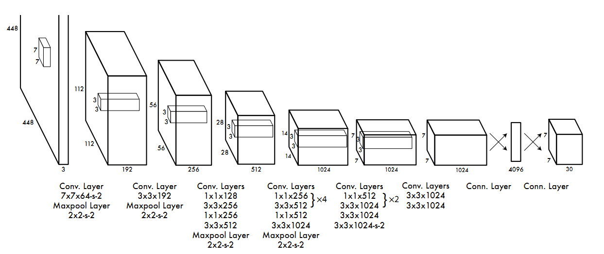
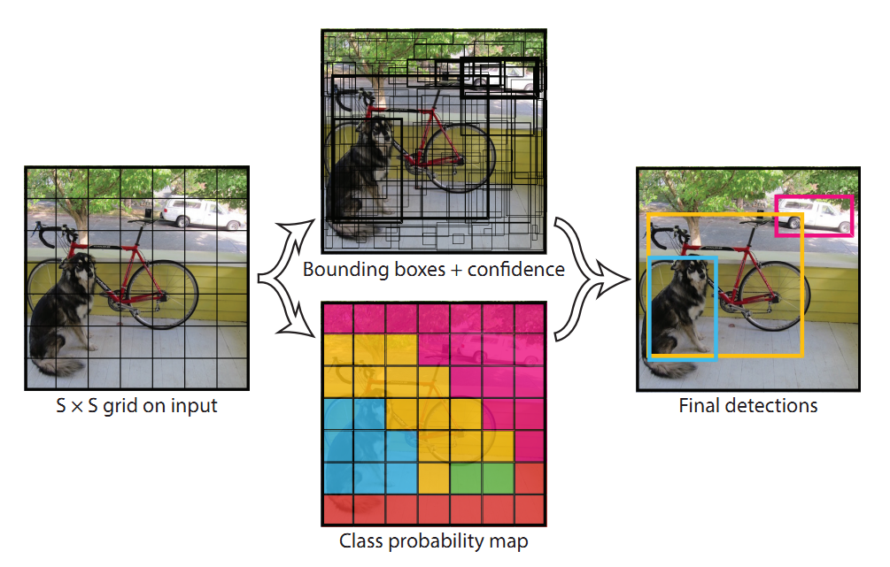
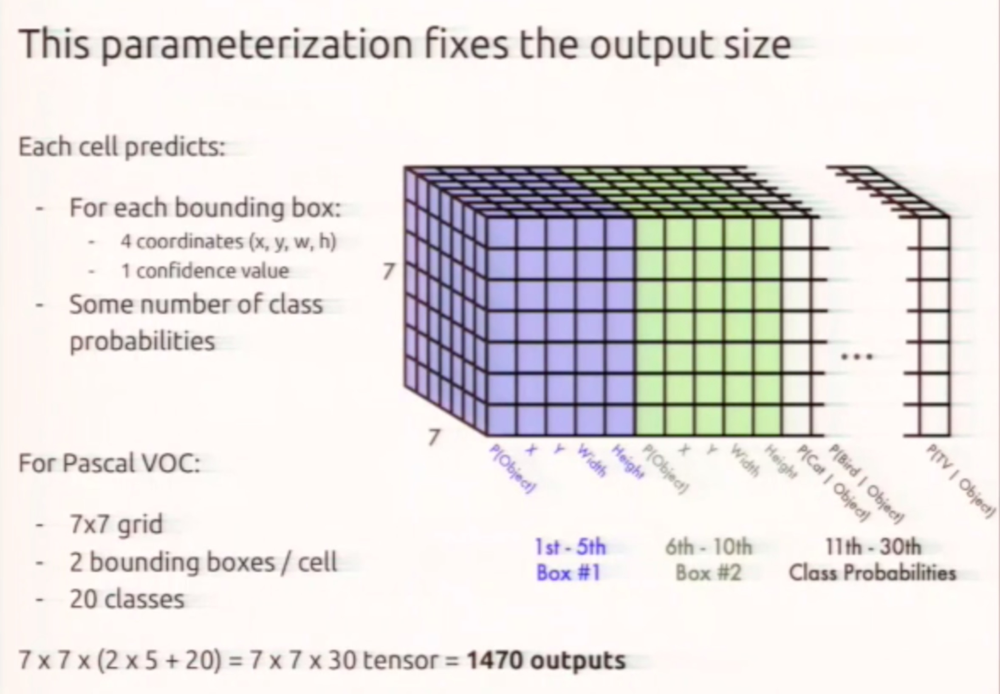
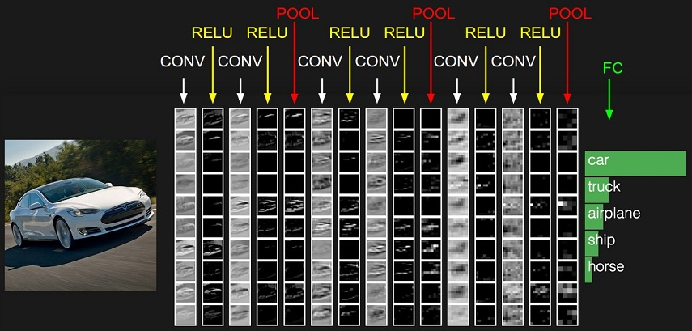
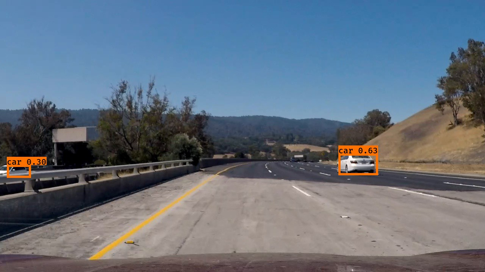
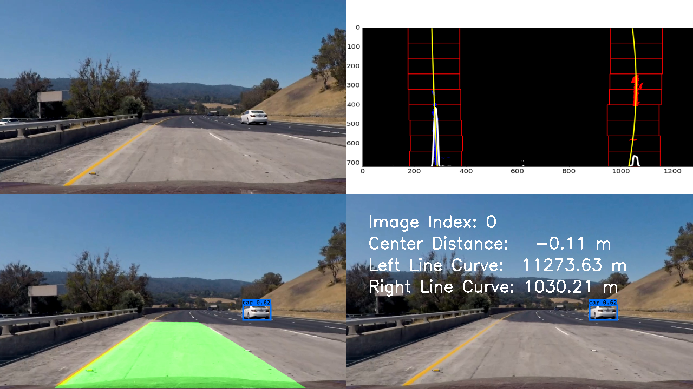
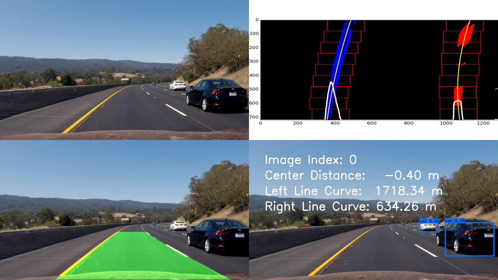
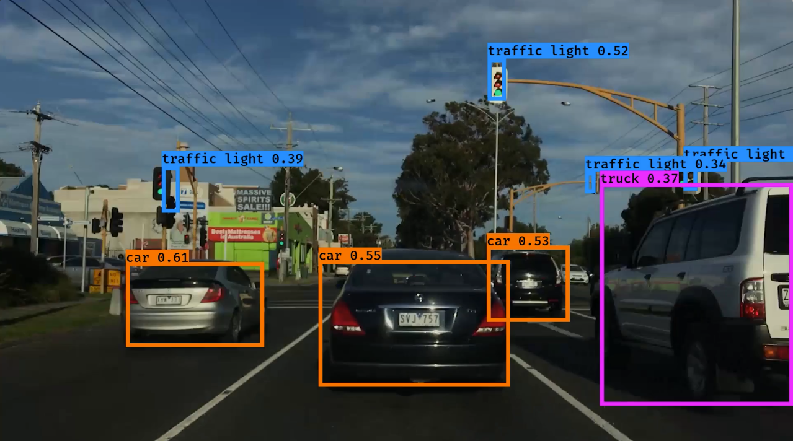
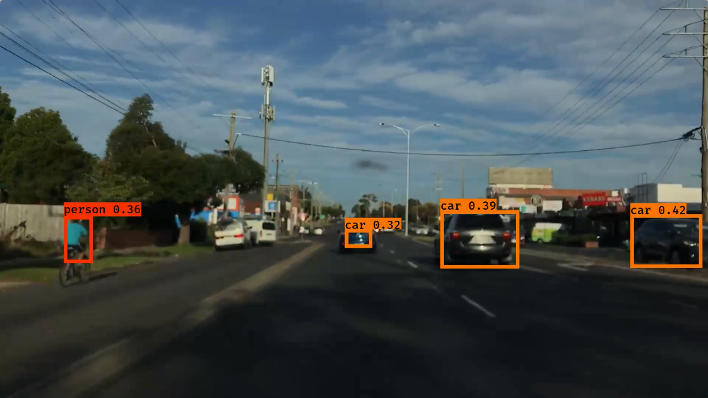

# Vehicle Detection
[](http://www.udacity.com/drive)


In this project, your goal is to write a software pipeline to detect vehicles in a video (start with the test_video.mp4 and later implement on full project_video.mp4)

## Object Detection
I have spent some time on trying SVM, color and gradient features to detect vehicle, 
svm has very good training accuracy but when testing in real life the accuracy dropped a lot. 
As the experience I have in p4 advanced lane finding and lots of reading about it, I 
think continue this way could make me pass the project video, but not able to handle my own 
video. All the work was in `test` folder, `test_features.py` and `test_window.py`.

In this project, I spend majority of my time trying to reach out for other options. I like SSD, 
U-NET, Faster-RCNN, but YOLO was my choice as it's fast while remains good result.
The result was good. it succeeded in project video, I then created a video from my iphone
which was mount in my car, YOLO performed very well on it.

## Project Video (High way)
In this video, camera calibration has been provided in folder `camera_cal`, lane finding and 
object detection images are camera calibrated.

<a href="http://www.youtube.com/watch?feature=player_embedded&v=Fi9j5cr_qEk" target="_blank">
</a>

## My Commuting Video
In this video there are cars in front of me which is the main problem for color and gradient
lane finding solution, so that I only applied object detecting into this video. we can see that
YOLO doing a great job here in detecting and tracking cars, traffic lights, etc.

<a href="http://www.youtube.com/watch?feature=player_embedded&v=OksuVuNY5o0" target="_blank">
</a>


## YOLO(You Only Look it Once) Object Detection 
[You only look once (YOLO)](https://pjreddie.com/darknet/yolo/) is a state-of-the-art, 
real-time object detection system. In this project I'm using [YAD2K project](https://github.com/allanzelener/YAD2K)
which is a Keras / Tensorflow implementation of YOLO_v2

>please note as we using YAD2K project, we have to install the specific keras version documented in YAD2K project page.

#####YOLO overall structure


### How YOLO works
1. Image will divided into small grid cell, for example 7 * 7
2. Every cell predict number of bounding box, every box contains
  - center_point_x
  - center_point_y
  - bounding_box_width
  - bounding_box_height
  - object_probability 
3. Every cell predict the probability of number of classes
4. Apply a threshold to all bounding_box



if we split image into 7 * 7 grid cell, each cell predict 2 bounding boxes, and we have 20 classes want to predict,
the total output would be 7 * 7 * （2 * 5 + 20) = 1470


### Pre-process and Data Augmentation
During training stage, all images has been random scaling and translations of up to 20% of the original image size,
also randomly adjust the exposure and saturation of the image by up to a factor of 1.5 in the **HSV** color space

Before feeding into network, the image will be resize into 416x416, the network will split this image further into
7x7 grid. All image will normalised between 0 to 1 before feed into network.

### Feature Extraction
YOLO network architecture is inspired by the GoogLeNet, it contains 24 convolutional layers followed by 2 full connected 
layters. Used 1x1 convolutional layers reduced the features space, followed by 3x3 convolution layers.

Just like HOG(Histogram of oriented gradient) or orientation histograms, gradient computation is the first step.
HOG using [-1, 0, 1] and [-1, 0. 1]T as filter kernels, however YOLO contains 7x7 and lots of 3x3, 1x1 filters, 
the parameters of those filter are learned from training process.
After the training and if we look at first layer, the edge, direction, colors, shapes start to form as features, this 
is similary to HOG, as show below


However CNN could stack those kind of layers, the higher the layer the bigger receptive field it have, thus will 
got better abstraction about the feature



###Post process

#### Scale boxes back to original image shape
All the prediction are based on 418x418 scaled image size, to make the result useful we have to re-scale back
to original image shape

#### Non maximum suppression
It is possibly network found lots of bounding boxes, in this case we use Non-maximum suppression to get the 
best result. code `yolo_eval` method in [`keras-yolo.py`](yolo/yad2k/models/keras_yolo.py)


### YOLO code in this project
The main code located in `object_detect_yolo.py`, all support files are in `yolo` folder.
- `yolo/cfg/yolo.cfg` defines the neural network structure
- `yolo/model_data/coco_classes.txt` defines how many classes system can detect
- `yolo/model_data/yolo.h5` the weights pre-trained on COCO dataset, follows yolo.cfg neural network structure

`predict` method in class `YoloDetector` is the main entry point, provide a image and it will 
return back bounding_boxes, scores and classes, for example:
- bounding_boxes=[[405, 786, 492, 934]]
- scores=[0.68]
- classes=[2]

 


For more test images, please visit [object detect folder](output_images/object-detect/)

## Merge YOLO with advanced lane finding
Class `LaneFinder` in `lane_finder.py` has been modified to add one more parameter called `object_detection_func`,
by default, it's a lambda which return a black image ```object_detection_func=lambda image: np.zeros_like(image)```

Undistored image will pass into object_detection_func and been added into final result.





##Discussion
1. Handle picked features not generalize enough
> As the experience in P3 advanced lane finding, and some experience in this project, I think the color, color space, 
gradient features with SVM or Decision Tress are not generalize enough, I think it's really depends on parameters 
which human provide, where deep learning approch is more define the lose function and let computer figure out what's
the best parameters, as long as we have lots of training data, it can do better then human picked parameters.

2. YOLO works really well
>The project video works really well as it dosen't have many elements
My own video was not focused properly, but still YOLO able to identify vehicles, traffic lights and a person on bicycle



3. a heat-map or moving average solution would beneficial still
>I noticed that it will miss some object in some frame, if we lower the threshold which resulting more object
been detected, at the same time create a heat map based on history data. 
For example a Car has been detected in last 3 frame, we have very high confidence that it will appear 
in frame 4 and 5, however if still not detected in frame 6, we can remove it away from our list.


## References
- [Stanford CS class CS231n: Convolutional Neural Networks](http://cs231n.github.io/convolutional-networks/)
- [Paper You Only Look Once: Unified, Real-Time Object Detection](https://arxiv.org/pdf/1506.02640v5.pdf)

## Model Summary
```
____________________________________________________________________________________________________
Layer (type)                     Output Shape          Param #     Connected to                     
====================================================================================================
input_1 (InputLayer)             (None, 416, 416, 3)   0                                            
____________________________________________________________________________________________________
convolution2d_1 (Convolution2D)  (None, 416, 416, 32)  864         input_1[0][0]                    
____________________________________________________________________________________________________
batchnormalization_1 (BatchNorma (None, 416, 416, 32)  128         convolution2d_1[0][0]            
____________________________________________________________________________________________________
leakyrelu_1 (LeakyReLU)          (None, 416, 416, 32)  0           batchnormalization_1[0][0]       
____________________________________________________________________________________________________
maxpooling2d_1 (MaxPooling2D)    (None, 208, 208, 32)  0           leakyrelu_1[0][0]                
____________________________________________________________________________________________________
convolution2d_2 (Convolution2D)  (None, 208, 208, 64)  18432       maxpooling2d_1[0][0]             
____________________________________________________________________________________________________
batchnormalization_2 (BatchNorma (None, 208, 208, 64)  256         convolution2d_2[0][0]            
____________________________________________________________________________________________________
leakyrelu_2 (LeakyReLU)          (None, 208, 208, 64)  0           batchnormalization_2[0][0]       
____________________________________________________________________________________________________
maxpooling2d_2 (MaxPooling2D)    (None, 104, 104, 64)  0           leakyrelu_2[0][0]                
____________________________________________________________________________________________________
convolution2d_3 (Convolution2D)  (None, 104, 104, 128) 73728       maxpooling2d_2[0][0]             
____________________________________________________________________________________________________
batchnormalization_3 (BatchNorma (None, 104, 104, 128) 512         convolution2d_3[0][0]            
____________________________________________________________________________________________________
leakyrelu_3 (LeakyReLU)          (None, 104, 104, 128) 0           batchnormalization_3[0][0]       
____________________________________________________________________________________________________
convolution2d_4 (Convolution2D)  (None, 104, 104, 64)  8192        leakyrelu_3[0][0]                
____________________________________________________________________________________________________
batchnormalization_4 (BatchNorma (None, 104, 104, 64)  256         convolution2d_4[0][0]            
____________________________________________________________________________________________________
leakyrelu_4 (LeakyReLU)          (None, 104, 104, 64)  0           batchnormalization_4[0][0]       
____________________________________________________________________________________________________
convolution2d_5 (Convolution2D)  (None, 104, 104, 128) 73728       leakyrelu_4[0][0]                
____________________________________________________________________________________________________
batchnormalization_5 (BatchNorma (None, 104, 104, 128) 512         convolution2d_5[0][0]            
____________________________________________________________________________________________________
leakyrelu_5 (LeakyReLU)          (None, 104, 104, 128) 0           batchnormalization_5[0][0]       
____________________________________________________________________________________________________
maxpooling2d_3 (MaxPooling2D)    (None, 52, 52, 128)   0           leakyrelu_5[0][0]                
____________________________________________________________________________________________________
convolution2d_6 (Convolution2D)  (None, 52, 52, 256)   294912      maxpooling2d_3[0][0]             
____________________________________________________________________________________________________
batchnormalization_6 (BatchNorma (None, 52, 52, 256)   1024        convolution2d_6[0][0]            
____________________________________________________________________________________________________
leakyrelu_6 (LeakyReLU)          (None, 52, 52, 256)   0           batchnormalization_6[0][0]       
____________________________________________________________________________________________________
convolution2d_7 (Convolution2D)  (None, 52, 52, 128)   32768       leakyrelu_6[0][0]                
____________________________________________________________________________________________________
batchnormalization_7 (BatchNorma (None, 52, 52, 128)   512         convolution2d_7[0][0]            
____________________________________________________________________________________________________
leakyrelu_7 (LeakyReLU)          (None, 52, 52, 128)   0           batchnormalization_7[0][0]       
____________________________________________________________________________________________________
convolution2d_8 (Convolution2D)  (None, 52, 52, 256)   294912      leakyrelu_7[0][0]                
____________________________________________________________________________________________________
batchnormalization_8 (BatchNorma (None, 52, 52, 256)   1024        convolution2d_8[0][0]            
____________________________________________________________________________________________________
leakyrelu_8 (LeakyReLU)          (None, 52, 52, 256)   0           batchnormalization_8[0][0]       
____________________________________________________________________________________________________
maxpooling2d_4 (MaxPooling2D)    (None, 26, 26, 256)   0           leakyrelu_8[0][0]                
____________________________________________________________________________________________________
convolution2d_9 (Convolution2D)  (None, 26, 26, 512)   1179648     maxpooling2d_4[0][0]             
____________________________________________________________________________________________________
batchnormalization_9 (BatchNorma (None, 26, 26, 512)   2048        convolution2d_9[0][0]            
____________________________________________________________________________________________________
leakyrelu_9 (LeakyReLU)          (None, 26, 26, 512)   0           batchnormalization_9[0][0]       
____________________________________________________________________________________________________
convolution2d_10 (Convolution2D) (None, 26, 26, 256)   131072      leakyrelu_9[0][0]                
____________________________________________________________________________________________________
batchnormalization_10 (BatchNorm (None, 26, 26, 256)   1024        convolution2d_10[0][0]           
____________________________________________________________________________________________________
leakyrelu_10 (LeakyReLU)         (None, 26, 26, 256)   0           batchnormalization_10[0][0]      
____________________________________________________________________________________________________
convolution2d_11 (Convolution2D) (None, 26, 26, 512)   1179648     leakyrelu_10[0][0]               
____________________________________________________________________________________________________
batchnormalization_11 (BatchNorm (None, 26, 26, 512)   2048        convolution2d_11[0][0]           
____________________________________________________________________________________________________
leakyrelu_11 (LeakyReLU)         (None, 26, 26, 512)   0           batchnormalization_11[0][0]      
____________________________________________________________________________________________________
convolution2d_12 (Convolution2D) (None, 26, 26, 256)   131072      leakyrelu_11[0][0]               
____________________________________________________________________________________________________
batchnormalization_12 (BatchNorm (None, 26, 26, 256)   1024        convolution2d_12[0][0]           
____________________________________________________________________________________________________
leakyrelu_12 (LeakyReLU)         (None, 26, 26, 256)   0           batchnormalization_12[0][0]      
____________________________________________________________________________________________________
convolution2d_13 (Convolution2D) (None, 26, 26, 512)   1179648     leakyrelu_12[0][0]               
____________________________________________________________________________________________________
batchnormalization_13 (BatchNorm (None, 26, 26, 512)   2048        convolution2d_13[0][0]           
____________________________________________________________________________________________________
leakyrelu_13 (LeakyReLU)         (None, 26, 26, 512)   0           batchnormalization_13[0][0]      
____________________________________________________________________________________________________
maxpooling2d_5 (MaxPooling2D)    (None, 13, 13, 512)   0           leakyrelu_13[0][0]               
____________________________________________________________________________________________________
convolution2d_14 (Convolution2D) (None, 13, 13, 1024)  4718592     maxpooling2d_5[0][0]             
____________________________________________________________________________________________________
batchnormalization_14 (BatchNorm (None, 13, 13, 1024)  4096        convolution2d_14[0][0]           
____________________________________________________________________________________________________
leakyrelu_14 (LeakyReLU)         (None, 13, 13, 1024)  0           batchnormalization_14[0][0]      
____________________________________________________________________________________________________
convolution2d_15 (Convolution2D) (None, 13, 13, 512)   524288      leakyrelu_14[0][0]               
____________________________________________________________________________________________________
batchnormalization_15 (BatchNorm (None, 13, 13, 512)   2048        convolution2d_15[0][0]           
____________________________________________________________________________________________________
leakyrelu_15 (LeakyReLU)         (None, 13, 13, 512)   0           batchnormalization_15[0][0]      
____________________________________________________________________________________________________
convolution2d_16 (Convolution2D) (None, 13, 13, 1024)  4718592     leakyrelu_15[0][0]               
____________________________________________________________________________________________________
batchnormalization_16 (BatchNorm (None, 13, 13, 1024)  4096        convolution2d_16[0][0]           
____________________________________________________________________________________________________
leakyrelu_16 (LeakyReLU)         (None, 13, 13, 1024)  0           batchnormalization_16[0][0]      
____________________________________________________________________________________________________
convolution2d_17 (Convolution2D) (None, 13, 13, 512)   524288      leakyrelu_16[0][0]               
____________________________________________________________________________________________________
batchnormalization_17 (BatchNorm (None, 13, 13, 512)   2048        convolution2d_17[0][0]           
____________________________________________________________________________________________________
leakyrelu_17 (LeakyReLU)         (None, 13, 13, 512)   0           batchnormalization_17[0][0]      
____________________________________________________________________________________________________
convolution2d_18 (Convolution2D) (None, 13, 13, 1024)  4718592     leakyrelu_17[0][0]               
____________________________________________________________________________________________________
batchnormalization_18 (BatchNorm (None, 13, 13, 1024)  4096        convolution2d_18[0][0]           
____________________________________________________________________________________________________
leakyrelu_18 (LeakyReLU)         (None, 13, 13, 1024)  0           batchnormalization_18[0][0]      
____________________________________________________________________________________________________
convolution2d_19 (Convolution2D) (None, 13, 13, 1024)  9437184     leakyrelu_18[0][0]               
____________________________________________________________________________________________________
batchnormalization_19 (BatchNorm (None, 13, 13, 1024)  4096        convolution2d_19[0][0]           
____________________________________________________________________________________________________
leakyrelu_19 (LeakyReLU)         (None, 13, 13, 1024)  0           batchnormalization_19[0][0]      
____________________________________________________________________________________________________
convolution2d_20 (Convolution2D) (None, 13, 13, 1024)  9437184     leakyrelu_19[0][0]               
____________________________________________________________________________________________________
batchnormalization_20 (BatchNorm (None, 13, 13, 1024)  4096        convolution2d_20[0][0]           
____________________________________________________________________________________________________
space_to_depth_x2 (Lambda)       (None, 13, 13, 2048)  0           leakyrelu_13[0][0]               
____________________________________________________________________________________________________
leakyrelu_20 (LeakyReLU)         (None, 13, 13, 1024)  0           batchnormalization_20[0][0]      
____________________________________________________________________________________________________
merge_1 (Merge)                  (None, 13, 13, 3072)  0           space_to_depth_x2[0][0]          
                                                                   leakyrelu_20[0][0]               
____________________________________________________________________________________________________
convolution2d_21 (Convolution2D) (None, 13, 13, 1024)  28311552    merge_1[0][0]                    
____________________________________________________________________________________________________
batchnormalization_21 (BatchNorm (None, 13, 13, 1024)  4096        convolution2d_21[0][0]           
____________________________________________________________________________________________________
leakyrelu_21 (LeakyReLU)         (None, 13, 13, 1024)  0           batchnormalization_21[0][0]      
____________________________________________________________________________________________________
convolution2d_22 (Convolution2D) (None, 13, 13, 425)   435625      leakyrelu_21[0][0]               
====================================================================================================
Total params: 67,465,609
Trainable params: 67,445,065
Non-trainable params: 20,544
____________________________________________________________________________________________________
```

# Run This Project
## Install Miniconda
Documentation: https://conda.io/docs/install/quick.html
```bash
wget https://repo.continuum.io/miniconda/Miniconda3-latest-Linux-x86_64.sh

bash Miniconda3-latest-Linux-x86_64.sh
```

## Install all dependencies
https://conda.io/docs/using/envs.html#share-an-environment
```bash
conda env create -f environment.yml
```

`python --version` to check python version, you should have python 3.5

## Main EntryPoint
[./main.py](main.py)
